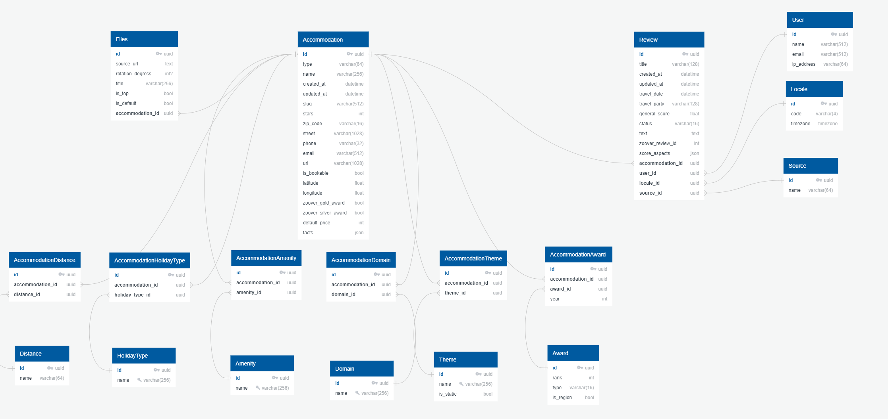

# Ratings
The Ratings is a Python-based application that calculates scores for accommodations based on user reviews. The application consists of two services:
1. Data Service
2. Scoring Service

## Stack

* python 3.10.11
* fastAPI 3.10.11
* alembic 1.13.2
* sqlalchemy 2.0.35
* asyncpg 0.28.0
* aioredis 1.3.1
* redis 7.2.1
* postgres 15.1

## Database Schema

[](https://github.com/avnosov3/ratings)


## Installation

1. Run the following commands
```
git clone git@github.com:avnosov3/ratings.git
```
```
cd ratings
```
2. Create an .env file in each service. You can rename .env.example to .env
3. Run *make up* to start services
```shell
make up
```
4. Run *make downv* to stop services
```shell
make downv
```

## API Docs

1. [DataServiceDocs](http://localhost:8000/docs)
2. [ScoringServiceDocs](http://localhost:8001/docs)

## Features

- Pagination
- Dependency Injection
- Docker
- Caching
- Tests *make tests*

## Data Import
Data import is included in *make up* command

## Default Ports
- Data service database **5433:5432**
- Data service application **8000:8000**
- Scoring service redis **6379:6379**
- Scoring service application **8001:8000**
